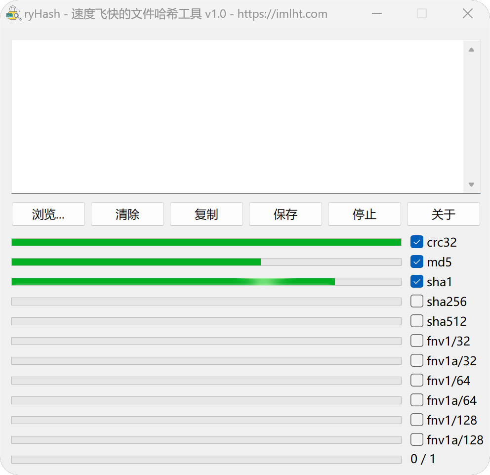
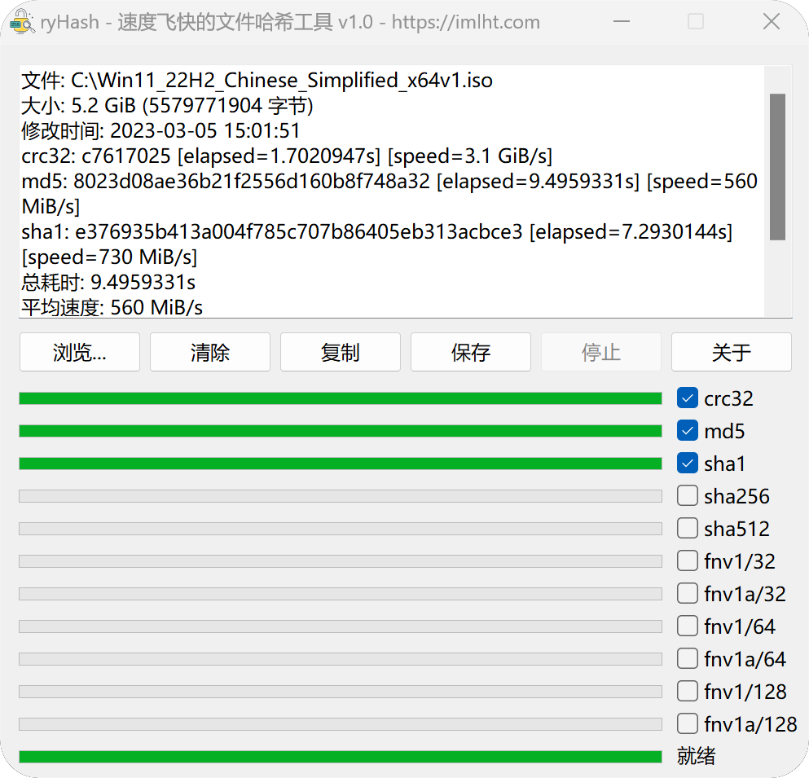
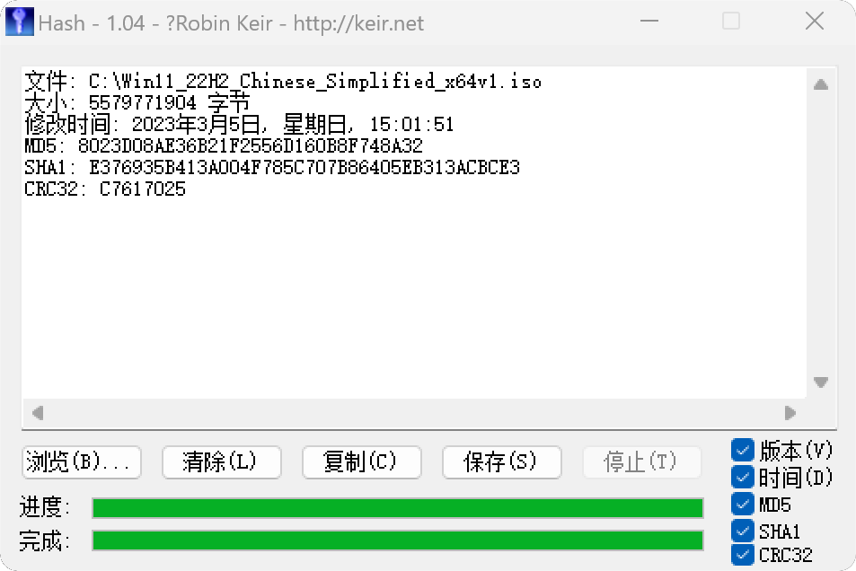

# ryHash - 速度飞快的文件哈希工具

**ryHash - 速度飞快的文件哈希工具！支持 CRC / MD5 / SHA / FNV 算法！**

本程序使用 `Go 语言` + [GoVCL](https://github.com/ying32/govcl) 编写，**原生跨平台 GUI 界面，非常小巧！**

利用 Go 语言天生的并发优势，极大提升文件哈希计算速度！

## 屏幕截图

#### 提供计算进度条:

#### 计算完毕:

#### 对比之前使用的软件:

## 使用方式

点击 `浏览...` 按钮，`选择文件` 则开始哈希；也支持 `文件拖放`，右下角支持勾选仅需计算的哈希值。

自行编译，需要 Go 编译器，最后 `make windows` 或 `make macos` 即可。

如果您想自己打包，可以下载 Lazarus 2.2.6 + FPC 3.2.2 自行生成对应平台的 liblcl.dll / liblcl.so / liblcl.dylib。

## 支持的操作系统和算法

操作系统：
- Windows：测试通过
- macOS：Intel 测试通过
- Linux：请自行编译

> 注：macOS M1 芯片存在使用几分钟后闪退问题，目前无解。

哈希算法（可扩充）：
- crc32
- md5
- sha1
- sha256
- sha512
- fnv1/32
- fnv1a/32
- fnv1/64
- fnv1a/64
- fnv1/128
- fnv1a/128
- ...

# Contribution

欢迎您提供宝贵意见！喜欢本项目麻烦点个 Star ！谢谢！

欢迎光临我的博客：https://imlht.com ！

# License

Apache-2.0 License

图标作者 [Ko.lnnn](https://www.iconfont.cn/collections/detail?cid=19252)，非商业使用。

# Stargazers over time

